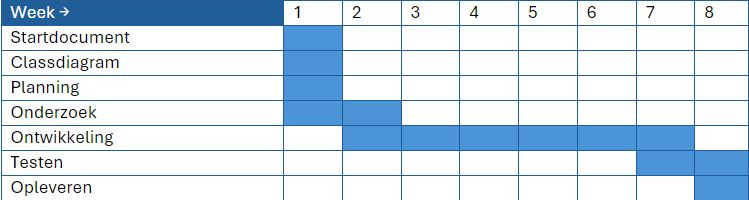
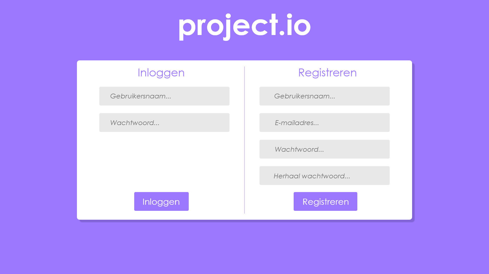
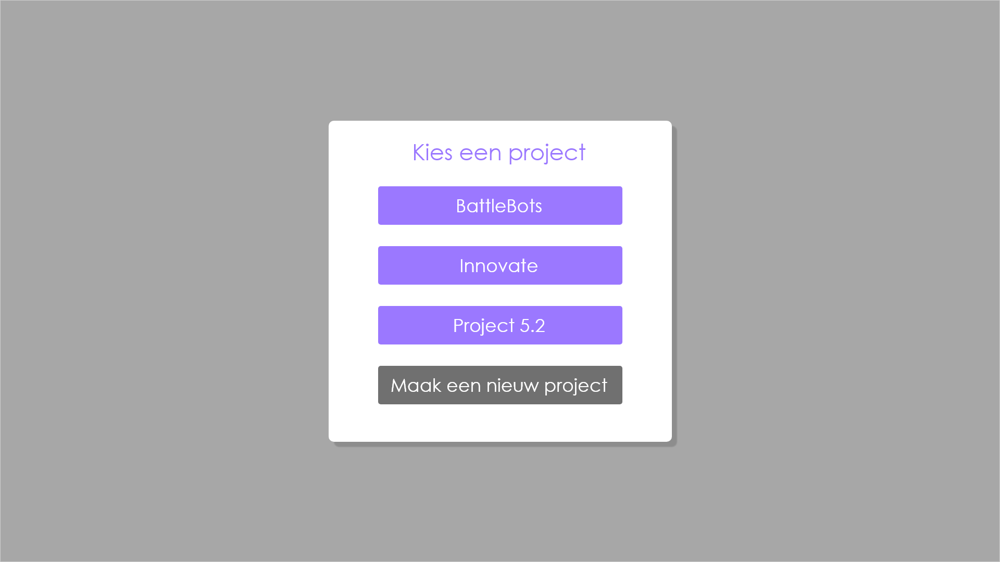
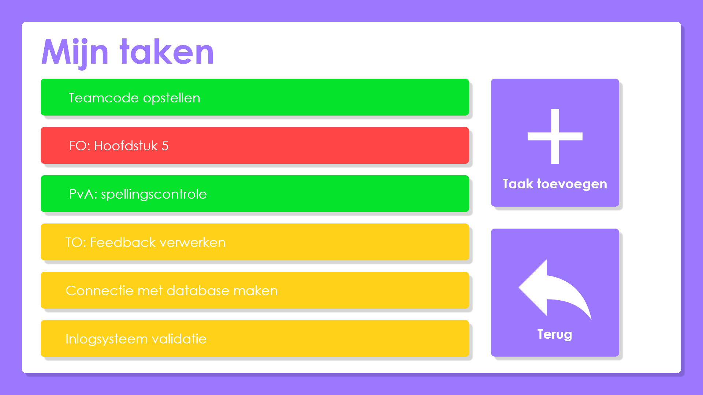
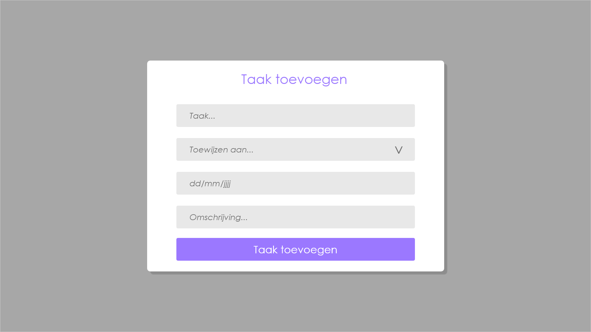
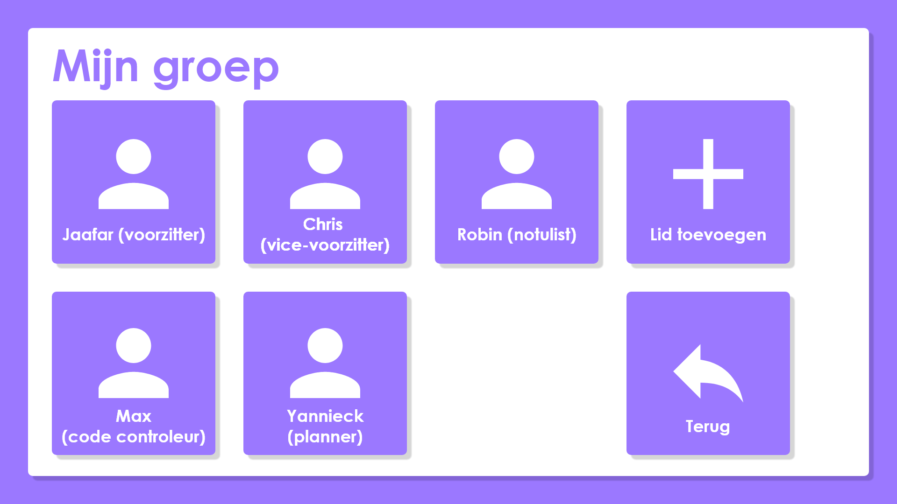
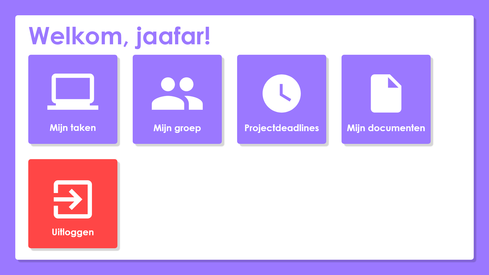
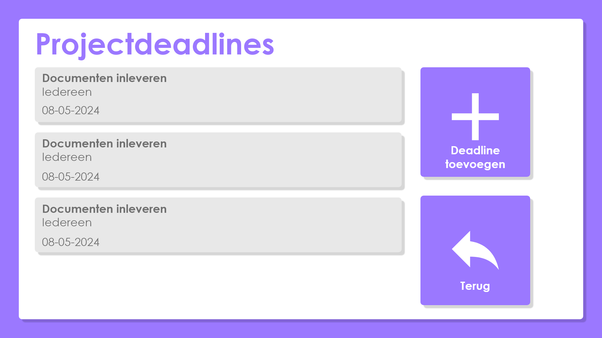
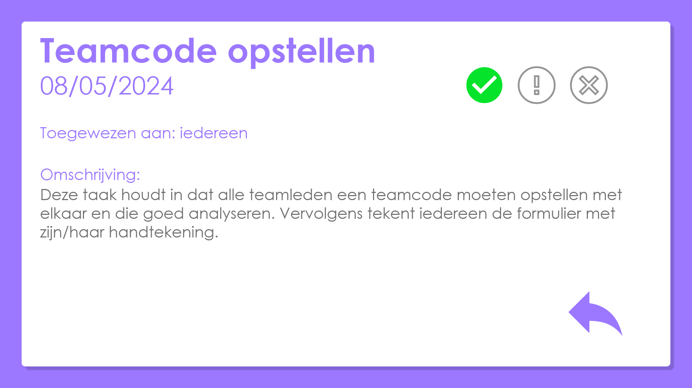
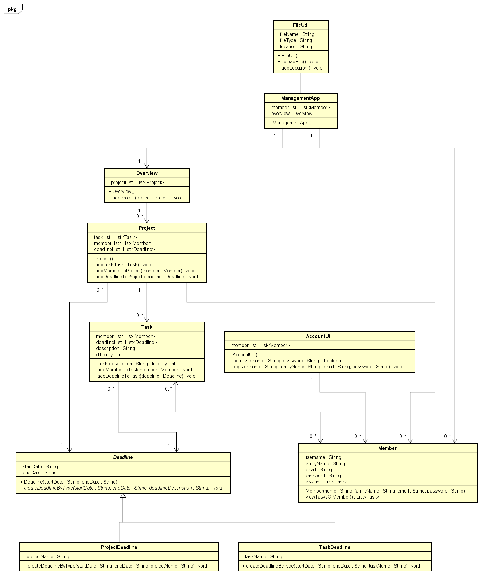

# StartDocument for Project.IO

StartDocument of **Robin van Dijk**, **Jaafar Jawadi**, **Luca Eisinga**, & **Bart Wijshake**.

## Application Description

Project.IO is an application, which can be used to manage projects. The application will be realized with .NET MAUI (https://learn.microsoft.com/en-us/dotnet/maui/what-is-maui?view=net-maui-8.0) and .NET 6+ (https://learn.microsoft.com/nl-nl/dotnet/core/whats-new/dotnet-8/overview) (Moste likely .NET 8) .
The application shall have a list of functionalities, in order to manage projects.
Like being able to add projects, create tasks, add deadlines and actually manage the project itself.

## Schedule

A schedule will be made, in order to gatekeep the progress of this project. This schedule contains a set of activities in a broad perspective, in order to visualize what we will be working on, every week until the deadline. A schedule isn't always perfect from the start, so there might be some errors and small corrections along the way, in order to meet our goal at the end of the road.

This project has started on monday, the 22nd of April 2024 & will end on friday, the 21st of June 2024.

## Requirements

The requirements will be determined by using the **MoSCoW-method**. By using the **MoSCoW-method**, the group is able to analyse and prioritize the functions in the according manner.

### Must Have:

First of all, the **Must-Haves**. These are necessary to the product itself in order for it to function properly.

### Should Have:

Secondly, the **Should-Haves**. These aren't necessary to the product, but still hold some importance. The main focus being, that they **Should** have been in the product, but aren't essential to make the product work.

### Could Have:

The third would be **Could-Haves**. These aren't necessary nor essential. They would be nice to have in the product as an extra.

### Won't Have:

Lastly, the **Won`t -Haves**. These, as the name suggests, will not be in the product at all.

| Nr  | Function in question                               | "???" Have  |
| --- | -------------------------------------------------- | ----------- |
| 1   | Must be able to login                              | Must Have   |
| 2   | Must be able to registrate                         | Must Have   |
| 3   | Must be able to add a project                      | Must Have   |
| 4   | Must be able to add a task                         | Must Have   |
| 5   | Must be able to add a deadline                     | Must Have   |
| 6   | Must be able to add a project member               | Must Have   |
| 7   | Must be able to assign and dismiss roles           | Must Have   |
| 8   | Must be able to view projects, tasks and deadlines | Must Have   |
| 9   | Should be able to add a file                       | Should Have |
| 10  | Should be able to formulate a teamcode             | Should Have |
| 11  | Should be able to add a schedule                   | Should Have |
| 12  | Could have a chat for every project                | Could Have  |
| 13  | Could have a voice chat environment                | Could Have  |
| 14  | Won't have an overview off a github repository     | Won't Have  |

## Screens

Login: The user can login on this screen in the application.

Registration: The user can registrate on this screen in the application.

Project: On this screen, the user can see all the projects where he or she participates in.

Tasks: On this screen, the user can see all tasks of a project.

Tasks adding: On this screen, the user can add a task to the project.

Members (for the project): On this screen, the user can see all members of the project.

Roles: On this screen, the user can assign & dismiss roles from other project members. This depends on the role of the user as well.

Project managament: On this screen, the project can be managed. Think about adding new tasks, deadlines or members.

Deadlines: On this screen, all deadlines can be seen.

TaskView: This screen is an example, of what a task may look like.

## Class Diagram

## Literature List

Davidbritch. (2023, 25 juli). _What is .NET MAUI? - .NET MAUI_. Microsoft Learn. https://learn.microsoft.com/en-us/dotnet/maui/what-is-maui?view=net-maui-8.0

Gewarren. (2024, 14 februari). _Nieuw in .NET 8_. Microsoft Learn. https://learn.microsoft.com/nl-nl/dotnet/core/whats-new/dotnet-8/overview